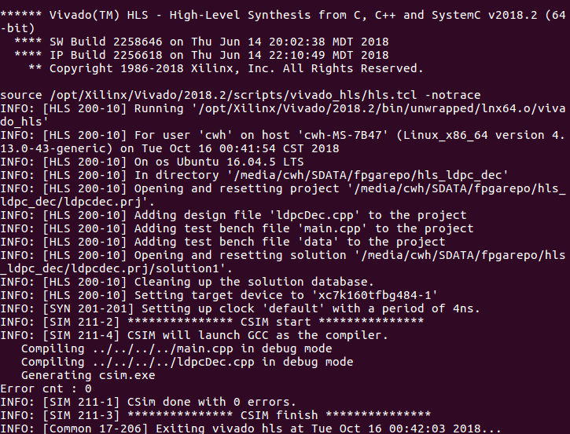
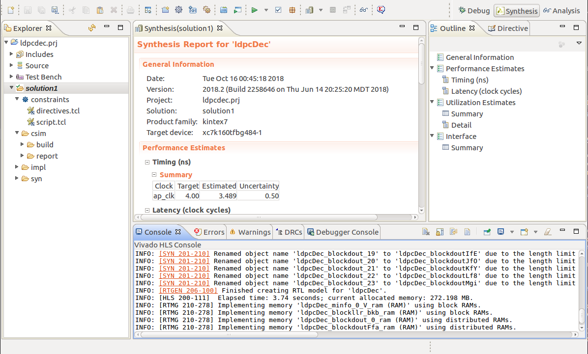
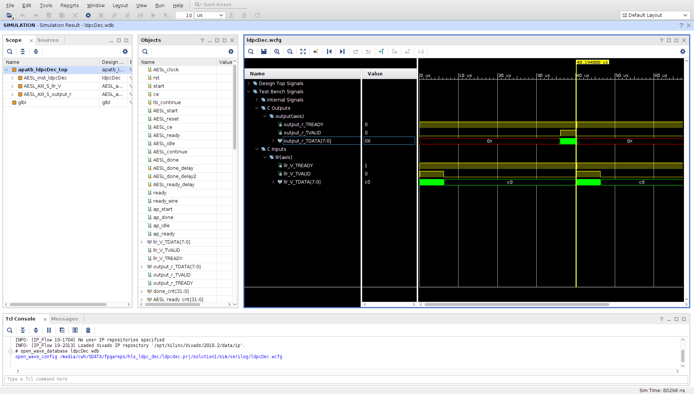

# hls_ldpc_dec
Full piplined LDPC decoder (IEEE 802.16e) implement in FPGA using Xilinx HLS(C synthesis to Verilog Codes).

## 1.Env & Build  
 **env** :   
 Vivado HLS 2018.2 or 2016.3 , MATLAB 2014a(for matlabcode)  
 **run** :  
 step1: `vivado_hls -f run_hls.tcl`   
  
 step2: lanch vivado HLS and open the project
  
 step3: Run C synthesis, C/RTL cosimulation e.t.c
  
## 2.Relative Link  
https://www.cnblogs.com/sea-wind/p/9789047.html